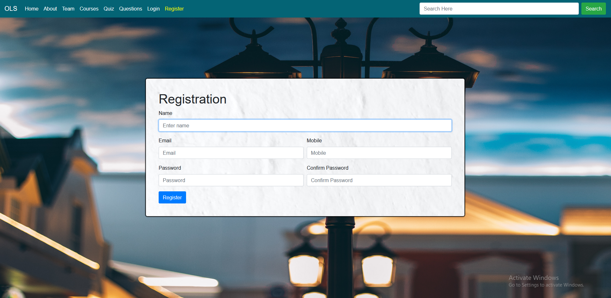
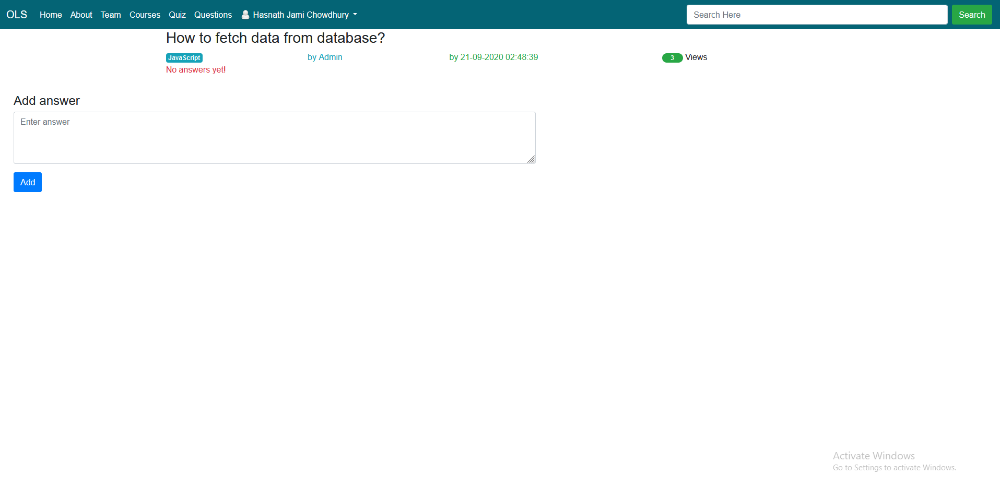

# Online-Learning-Synopsis
## Introduction
This is a web application designed to host quiz. The quiz can be based on any topic and the user can hone
his/her skill on the topic he/she is interested in. Besides, it contains a discussion platform for discussing the topics upon which the quiz are held.

## Objectives
This web application aims to be a platform for testing out one’s skills. By participating in the quiz designed
by experts, the user can figure out what he knows and what he needs to learn further about a certain topic.
Regularly participating in the quiz can bring improvements in one’s learning path of a topic/speciality. Besides
that, this web application also has a section dedicated to problem discussion and answers. It’s normal to get
stuck on a problem when learning something new. For tackling those situations, one can post about his/her
problem on the platform where other users can reply to those problems/questions. Overall, the main objective
of this application is to test one’s skill on certain topics and make the learning procedure faster and easier.

## Features:
### 1. Quiz System:
     -A registered user can take part in a quiz by filtering out certain topics.
     -A registered admin can set up and prepare quiz with whatever multiple choice answers he/she likes.
     -A user can get to see the mark obtained in a certain quiz. Also, the user can get to see the correct
      answers after he/she has completed the quiz.
     -Admins from affiliated institutions may host certain quiz that will be private for the users from those
      institutions only thus becoming an online quiz holding platform for different institutions.
     
     
### 2. Problem Discussion:
     -Users can post about their problems and questions about certain topics.
     -Other users can choose to reply to the questions asked.
     -Users can vote for or against the posted replies and thus others can identify the replies with the most
      "upvotes" as the best answers.
      
      
      
## ScreenShots:

  
  
  
  

  
  

  

      

 ## Conclusion
 Testing ourselves is one of the most important aspects of learning anything. It is even better if we can find other people with the same interest and have discussions with them. One can achieve that by using this platform and hope to get better at what he/she is learning.
 
 ## Contributors
 ### Hasnath Jami Chowdhury
   1. Responsive UI design for the full project
   2. Registration System.
   3. Discussion/Problem Sharing (Q/A) System (Categorized), Voting System.
   
 ### [Anas Mohammad Anwar](https://github.com/AnasAnwar11)
   1. Responsive UI design for the extra part.
   2. Quiz System (Categorized).
   3. User's Quiz History System.
 
 
